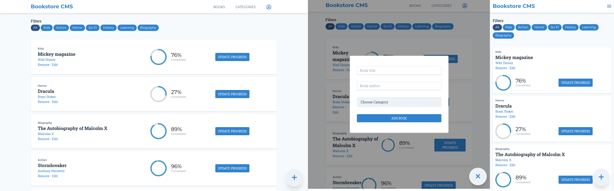

# Redux-Bookstore
> A react-redux powered bookstore



## Built With

- TailwindCSS
- React
- Redux
- Heroku Deployment

## Live Demo

[Live Demo Link](https://book-store-20.herokuapp.com/)


## Introduction
A bookstore application as part of practicing using **Redux**

**Features**
- Storing books in Redux Store
- Filtering books by category
- Adding new book with validations
- Build with Responsive design

### Setup
```
git clone git@github.com:mosaaleb/redux-bookstore.git
cd redux-bookstore
yarn install
```
**Server**
```
yarn react-scripts start
```


## Author

- [Muhammad Ebeid](https://github.com/mosaaleb)

## 📝 License
This project is [MIT](lic.url) licensed.
